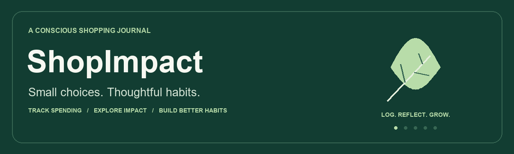
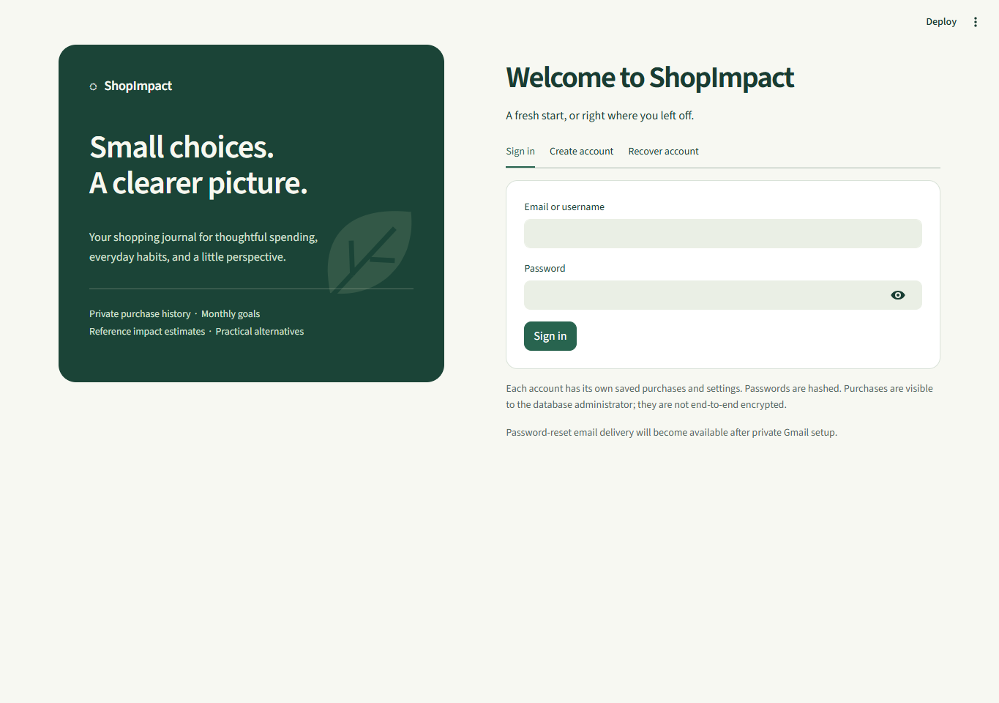
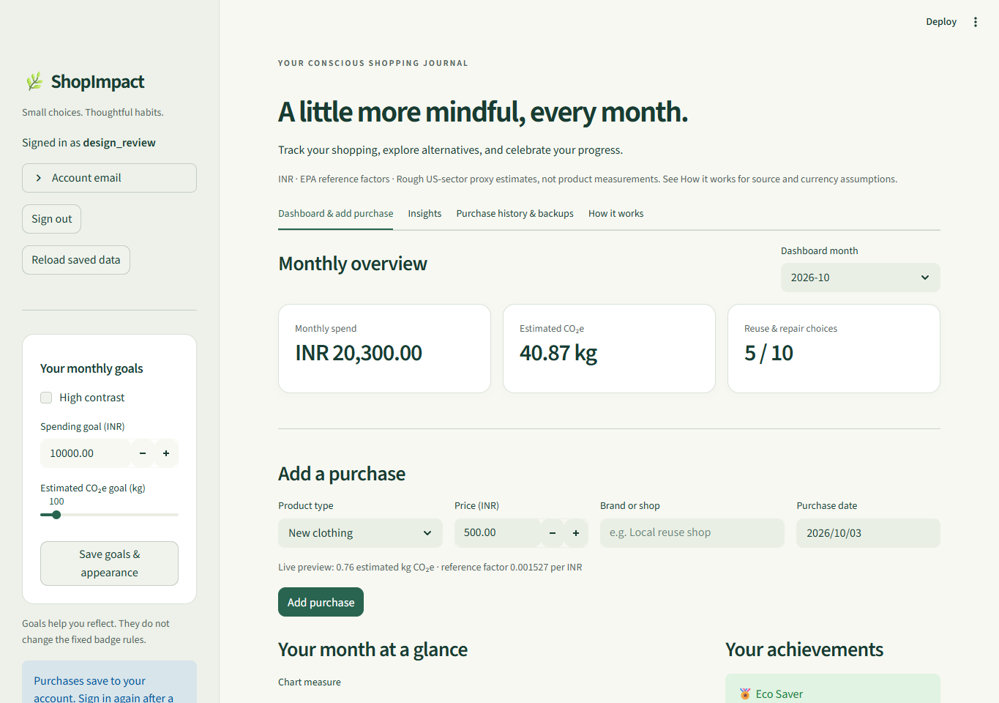
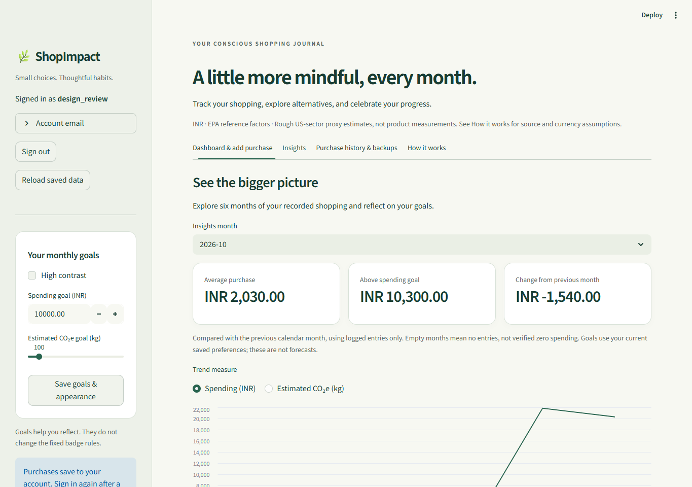
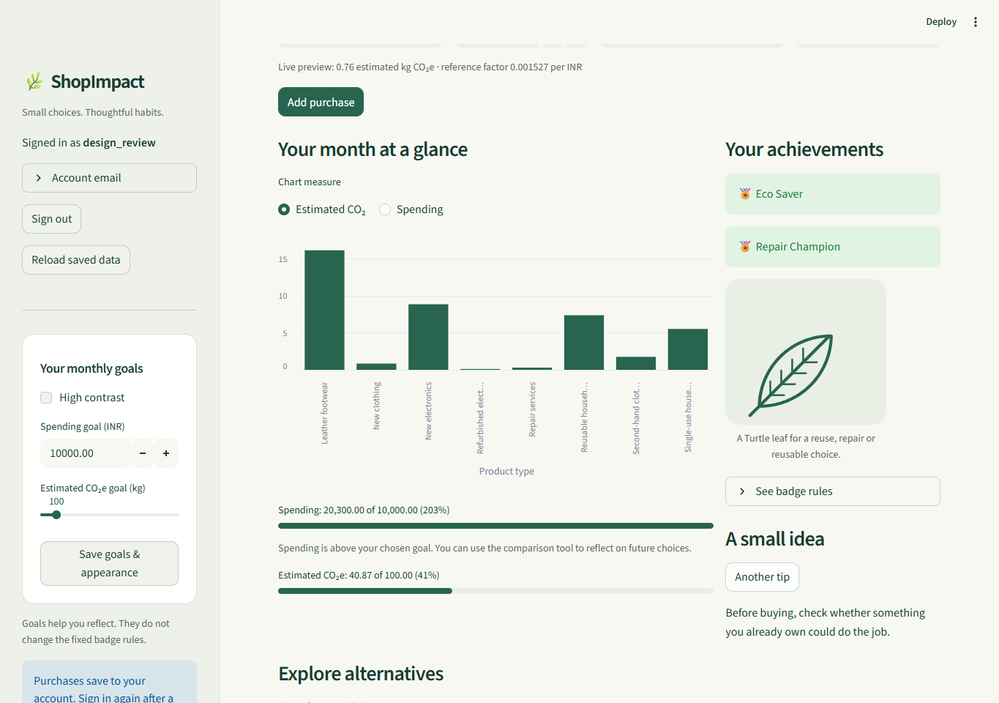
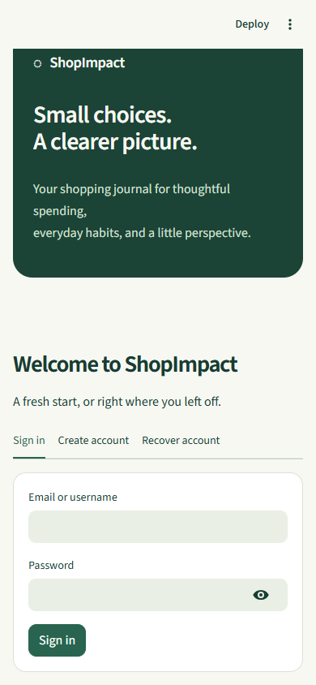
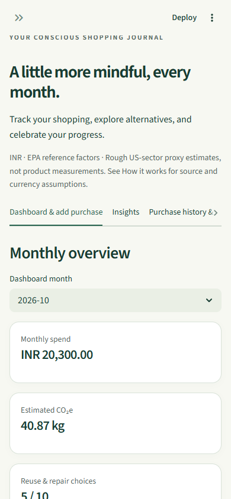
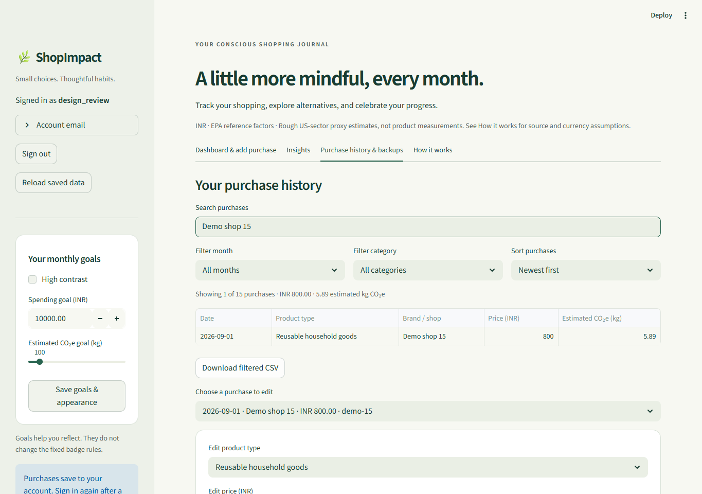
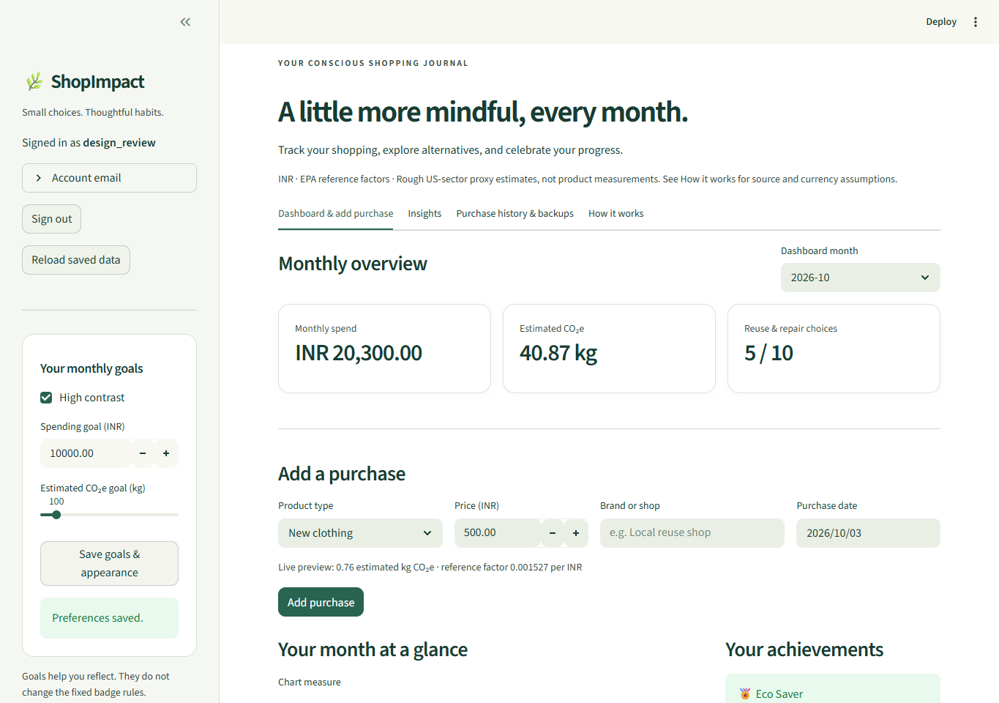
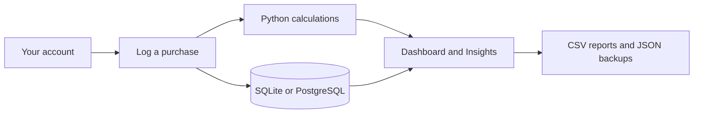

<p align="center">
  
</p>

<p align="center">
  <strong>Understand your shopping. Make your next choice more thoughtful.</strong><br>
  A Python + Streamlit app for purchase tracking, monthly goals, and estimated environmental impact.
</p>

<p align="center">
  <a href="https://shopimpact-duy7hphexgoshhqfexfmkt.streamlit.app/">Open live app</a> ·
  <a href="#features">Explore features</a> ·
  <a href="#screenshots">See the app</a> ·
  <a href="#run-in-vs-code">Run locally</a> ·
  <a href="output/pdf/ShopImpact_10_Page_Explanation.pdf">Read the 10-page guide</a>
</p>

<p align="center">
  <a href="https://github.com/kavin-beep/ShopImpact/actions/workflows/tests.yml"></a>
</p>

<p align="center"><sub>Prefer a still image? <a href="assets/readme/shopimpact-banner-static.png">View the static banner</a>.</sub></p>

| Built with | Persistence | Checks | Release status |
| :---: | :---: | :---: | :---: |
| Python 3.12 · Streamlit | SQLite / Neon PostgreSQL | 84 tests passed locally · 5 Oct 2026 | Live on Streamlit Cloud |

ShopImpact turns a purchase list into a useful shopping journal: record what you buy, see spending patterns, explore rough emissions estimates, and consider reuse or repair. It implements **Scenario 1** of the Year 1 Python Programming assessment.

> **An estimate, with a clear purpose.** CO₂e means carbon dioxide equivalent. ShopImpact estimates impact using price × category factor; it does not measure a specific product's actual emissions.

---

## Features

| Your shopping journal | Your bigger picture | Your next thoughtful choice |
| :--- | :--- | :--- |
| Log, find, edit and back up purchases | Track spending, estimated CO₂e and six-month trends | Explore alternatives, earn badges and build habits |
| Separate accounts and saved preferences | Monthly goals and accessible contrast settings | Reuse, repair, rotating tips and Turtle artwork |

<details>
<summary><strong>View the complete feature list</strong></summary>

- Registration with email, email-or-username/password sign-in, sign-out and recovery-code password reset.
- Existing accounts can add or change their sign-in email after confirming their current password.
- Private purchase histories and settings saved across restarts.
- Product type, brand/shop, price and date input with instant estimate preview.
- Month/year dashboard with spending, estimated kg CO2e, charts and goals.
- Polished green-and-cream interface, split sign-in page, responsive cards and readable contrast settings.
- Six-month Insights with logged spending/impact trends, average purchases, goal balance and previous-calendar-month comparison.
- Eco Saver, Low Impact Shopper and Repair Champion achievements.
- Conditional Turtle artwork, rotating tips and high contrast.
- Category alternatives, named reuse/repair options with official links, and price-based comparison with visible assumptions.
- Search, month/category filters, date/price/impact sorting, filtered CSV downloads, editing, deletion and JSON backup/restore.
- Confirmed account deletion and protection against conflicting edits in multiple tabs.

</details>

## Screenshots

A look inside ShopImpact. Screenshots use fictional purchases in an isolated test account.

| A welcoming start | Your monthly overview |
| :---: | :---: |
|  |  |
| **Spending patterns over time** | **Celebrate thoughtful choices** |
|  |  |

<details>
<summary><strong>Mobile, purchase history and high contrast</strong></summary>

| Mobile sign-in | Mobile dashboard |
| :---: | :---: |
|  |  |





</details>

## Run in VS Code

Open this entire SA PYTHON folder and run these commands in its PowerShell terminal:

```powershell
.\.venv\Scripts\python.exe -m pip install -r requirements.txt --no-cache-dir
.\.venv\Scripts\python.exe -m streamlit run app.py --server.address 127.0.0.1
```

On another computer, install Python 3.12 and first run `py -3.12 -m venv .venv`. VS Code tasks and the Run ShopImpact debug configuration are included. Debugging requires Microsoft's Python and Python Debugger extensions.

Open the URL printed in the terminal, normally http://localhost:8501. Create your own account, save the recovery code privately, and sign in. Accounts start empty; no demo purchases are loaded. Closing or refreshing the page signs you out but does not delete saved purchases. Sessions expire after 12 hours.

## Data and calculations

The 2026 refresh uses final USEEIO Supply Chain GHG Emission Factors v1.4.0, published in October 2025 by the Cornerstone Sustainability Data Initiative, with IPCC AR6 warming potentials and 2024 USD prices. INR factors use the matching World Bank 2024 annual-average exchange rate. Values, source rows, category mappings and source URLs are included in `data/emission_sources.json` and `data/product_catalog.json`.

These are **rough reference estimates**. US sector averages, broad category mappings, a fixed historical exchange rate and unadjusted current prices are not a validated India-specific product footprint. New and reused versions use the same underlying factor; no unsupported reuse discount is invented. Read [current methodology and migration policy](docs/2026-update.md). Existing purchases keep their stored estimates until explicitly recalculated in How it works.

## Files and integration

| File | Responsibility |
| --- | --- |
| app.py | Shopping interface, dashboard, goals, editing and backups |
| account_ui.py | Account screens and authenticated save flow |
| accounts.py | Argon2id passwords, sessions, recovery and database storage |
| logic.py | Decimal calculations, purchase dictionaries, monthly summaries, badge rules |
| insights.py | Six-month trends, goal balance and filtered history views |
| ui.py | Shared visual styling and sign-in branding |
| storage.py | Validated JSON import/export and spreadsheet-safe CSV |
| data/ | Product catalog, published source evidence and tips |
| tools/draw_rewards.py | Turtle leaf generation and optional desktop preview |
| tests/ | Disposable account/UI tests and synthetic purchase fixtures |
| docs/ | Design, methodology, test evidence, deployment and assessment checklist |



## Storage and privacy

Without hosted settings, accounts are stored in `personal_data/shopimpact.db`, excluded from Git. This workspace is now configured to use Neon PostgreSQL through private settings. Local SQLite accounts are not automatically migrated; export purchases before switching and restore them into a hosted account if needed. Each account has isolated purchases and settings. Passwords use salted Argon2id hashes; session and recovery tokens are stored as hashes. Five failed login/recovery attempts block that identifier for 15 minutes. Recovery rotates the code and revokes previous sessions. The database administrator can access purchase data; it is not end-to-end encrypted.

Purchases save automatically on successful add/edit/delete/restore. Goals and appearance save through their labelled button. Purchase JSON backups exclude credentials, sessions and settings. Imports support 1,000 records and 2 MB. Legacy illustrative backups require an explicit migration checkbox and have estimates recalculated. Downloaded backups remain on your computer after account deletion.

New registrations require a unique email address. Existing accounts keep their usernames, passwords and purchases after additive migrations. Add an email in the sidebar's **Account email** panel. Email matching ignores case; username and email sign-in share the account's failed-attempt counter.

Creating an account automatically signs the user in and opens the home dashboard. The sign-in page contains Sign in, Create account and Recover account tabs. The recovery code can be saved from an expandable panel on the home page.

Email verification and password-reset links are implemented. Gmail delivery is awaiting private sender setup; use the [Gmail setup guide](docs/email-setup.md). Verification is optional for dashboard access and available from the sidebar's Account email panel; a verified address is required for email password-reset links. Links expire, can be used once and are invalidated by relevant account changes. Resetting a password signs out existing sessions and replaces the recovery code. Google OAuth sign-in is not implemented.

## Turtle

```powershell
.\.venv\Scripts\python.exe tools/draw_rewards.py
.\.venv\Scripts\python.exe tools/draw_rewards.py --preview
```

The default command uses `turtle.TNavigator` with an SVG pen adapter. The optional preview uses `turtle.Turtle` and requires working Tk. The app displays the generated SVG when a qualifying choice exists; it is not a live browser Turtle animation. Desktop preview remains unverified in the bundled runtime. Confirm assessment acceptance of the SVG integration.

### Appearance themes

Open **Theme & animation** in the sidebar to choose **Normal** (the original look), **Day** (drifting clouds and a glowing sun), or **Night** (stars and occasional falling stars). Choices apply to the current browser session, including sign-in. Turn off **Animated scenery** for a still background. Device reduced-motion settings pause the scenery, and high contrast hides it.

## Verification

```powershell
.\.venv\Scripts\python.exe -m unittest discover -s tests -v
```

84 automated tests pass (5 October 2026), covering calculations, factor provenance, account isolation, persistence, recovery, rate limiting, concurrent saves, trends, filtering and interface workflows. Tests use disposable databases and do not write to real accounts. The 15-purchase synthetic fixture exists only for testing. See [test evidence](docs/testing.md).

## Deployment and assessment

The [repository readiness review](docs/repository-readiness.md) records the final checks and remaining launch/submission work. Invalid optional email settings now leave sign-in, shopping and recovery-code access available; email reset buttons remain disabled until valid settings are provided.

The [ten-page code and data guide](output/pdf/ShopImpact_10_Page_Explanation.pdf) is included for learning and review. Its test count describes the earlier 78-test snapshot; the current suite has 84 tests. The guide and screenshots predate the refreshed design and v3 reference data; see the 2026 update for the current methodology. It is separate from the final assessment submission document.

See [deployment instructions](docs/deployment.md). Neon PostgreSQL was connected and verified on 2 October 2026: registration, login, account isolation, purchase persistence across new connections, conflicting-save protection and logout passed. Temporary QA accounts were deleted. ShopImpact is now deployed on Streamlit Community Cloud, and the public sign-in page has been checked in the browser. Full account workflows on the deployed app, redeployment persistence and provider backup restoration remain pending verification.

Start hosted database setup with the [Neon walkthrough](docs/neon-setup.md) and private terminal helper.

Public app: [Open ShopImpact](https://shopimpact-duy7hphexgoshhqfexfmkt.streamlit.app/).

GitHub repository: [kavin-beep/ShopImpact](https://github.com/kavin-beep/ShopImpact).

Real participant feedback, assessor access and the final submission PDF remain pending. See [requirements](docs/requirements.md) and [feedback template](docs/usability-feedback.md). Screenshots use an isolated QA account and fictional input, not a preloaded demo workspace.

## References

- [USEEIO v1.4 published dataset](https://zenodo.org/records/17202747)
- [World Bank 2024 INR exchange rate](https://api.worldbank.org/v2/country/IND/indicator/PA.NUS.FCRF?date=2024&format=json)
- [Streamlit database guidance](https://docs.streamlit.io/develop/concepts/connections/connecting-to-data)
- [Python Turtle](https://docs.python.org/3/library/turtle.html)
- [OWASP password storage](https://cheatsheetseries.owasp.org/cheatsheets/Password_Storage_Cheat_Sheet.html)

## Credits
  Name: Kavin.K
  Grade: IBCP Y1
  Name of Mentor: Syedalibeema s
  Registration No: -
  Name of School: JainVidyalaya
  
